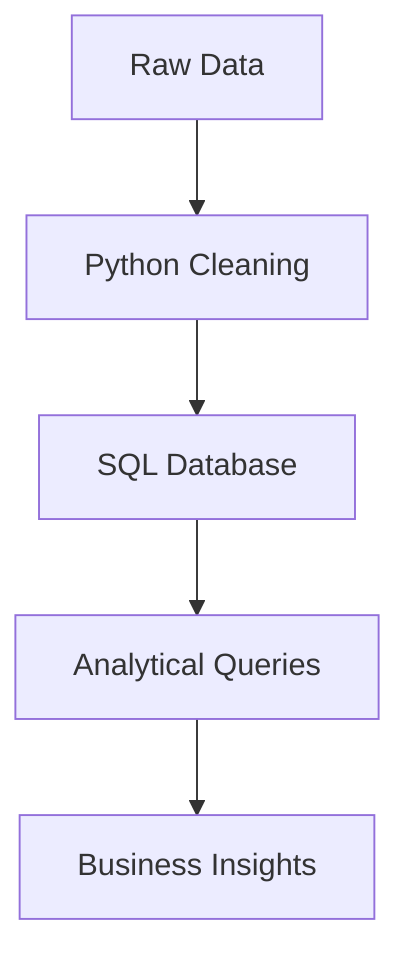

# Order-Retail-Dataset-Analysis


# Retail Sales Data Analysis Project

 


## 📌 Overview
An end-to-end data analysis project examining retail sales patterns using Python for ETL and SQL for analytical insights. The project identifies top-performing products, regional trends, and year-over-year growth metrics.

## 🎯 Objectives
- Perform exploratory data analysis on retail transactions
- Identify high-value products and customer segments
- Analyze temporal and geographic sales patterns
- Generate actionable business recommendations

## 📂 Dataset
Downloaded from [kaggle Dataset Link](https://www.kaggle.com/datasets/ankitbansal06/retail-orders)
- `orders.csv` containing:
- 9,994 transactions (Jan 2022 - Aug 2023)
- Key dimensions: Product, Category, Region
- Metrics: Sales, Profit, Quantity, Discounts

## 🛠️ Technical Implementation
### Tools & Technologies

- **Python**  
  - `pandas`, `numpy` – Data Cleaning, Data manipulation  
  - `sqlalchemy` – Data Exporting
- **Jupyter Notebook** – For interactive development
- **DBMS:** MSSql
- **Query Language:** SQL (DDL, DML, Aggregations, Joins, Subqueries, Window Functions)
- **Git & GitHub** – Version control and project showcase
-   
- 

## Data Processing Pipeline


---

## Step 1
**Import Python dependecies**
```python
import pandas as pd
import numpy as np
import sqlalchemy as sal
```
## Step 2
**Load Datasets, exporation**
```python
#read data from the file and handle null values

df = pd.read_csv('orders.csv', na_values ='Not Available')

#Exploring dataset

df.head(10)
```
** 🧼 Data Cleaning and Transformation with Python**
- Renamed columns to lowercase with underscores for consistency
- Derived new columns:
   - Discount amount (list_price * discount_percent)
   - Sale price (list_price - discount)
   - Profit (list_price - cost_price)
- Converted order_date to datetime format
- Dropped unnecessary columns (cost_price, list_price, discount_percent)
```python
#Renamed columns to lowercase with underscores for consistency

df.columns = df.columns.str.lower().str.replace(' ', '_')

#Discount amount (list_price * discount_percent)
df['discount'] = df['list_price']*df['discount_percent']*.01

#Sale price (list_price - discount)
df['sale_price'] = df['list_price'] - df['discount']

#Profit (list_price - cost_price)
df['profit'] = df['list_price'] - df['sale_price']

#Converted order_date to datetime format
df['order_date'] = pd.to_datetime(df['order_date'], format="%Y-%m-%d")

#Dropped unnecessary columns (cost_price, list_price, discount_percent)
df.drop(['cost_price','list_price','discount_percent'], axis=1, inplace=True)
```

**Data Export to SQL Server using SQLAlchemy**
- Established connection to SQL Server using SQLAlchemy
- Created a new table 'df_orders' with appropriate data types
- Loaded the cleaned DataFrame into SQL Server
```python
#create connection
engine = sal.create_engine('mssql://DESKTOP-4Q09OUU\SQLEXPRESS/orders_db?driver=ODBC+DRIVER+17+FOR+SQL+SERVER')
conn=engine.connect()

#load the data into sql server using append option
df.to_sql('df_orders', con=conn , index=False, if_exists = 'append')
```

--- 
## 🧮 SQL ANALYSIS
### Created several analytical queries to extract business insights:

**Top 10 Highest Revenue Generating Products**
```sql
SELECT TOP 10 product_id, SUM(sale_price) AS sales
FROM df_orders
GROUP BY product_id
ORDER BY sales DESC;
```

**Top 5 Highest Selling Products in Each Region**
```sql
WITH cte AS (
    SELECT region, product_id, SUM(sale_price) AS sales
    FROM df_orders
    GROUP BY region, product_id
)
SELECT * FROM (
    SELECT *,
    ROW_NUMBER() OVER(PARTITION BY region ORDER BY sales DESC) AS rn
    FROM cte
) A
WHERE rn <= 5;
```

**Month-over-Month Growth Comparison (2022 vs 2023)**
```sql
WITH cte AS (
    SELECT YEAR(order_date) AS order_year, MONTH(order_date) AS order_month,
    SUM(sale_price) AS sales
    FROM df_orders
    GROUP BY YEAR(order_date), MONTH(order_date)
)
SELECT order_month,
    SUM(CASE WHEN order_year = 2022 THEN sales ELSE 0 END) AS sales_2022,
    SUM(CASE WHEN order_year = 2023 THEN sales ELSE 0 END) AS sales_2023
FROM cte 
GROUP BY order_month
ORDER BY order_month;
```

**Highest Sales Month for Each Category**
```sql
WITH cte AS (
    SELECT category, FORMAT(order_date, 'yyyyMM') AS order_year_month,
    SUM(sale_price) AS sales 
    FROM df_orders
    GROUP BY category, FORMAT(order_date, 'yyyyMM')
)
SELECT * FROM (
    SELECT *,
    ROW_NUMBER() OVER(PARTITION BY category ORDER BY sales DESC) AS rn
    FROM cte
) A
WHERE rn = 1;
```
**Subcategory with Highest Profit Growth (2023 vs 2022)**
```sql
WITH cte AS (
    SELECT sub_category, YEAR(order_date) AS order_year,
    SUM(sale_price) AS sales
    FROM df_orders
    GROUP BY sub_category, YEAR(order_date)
),
cte2 AS (
    SELECT sub_category,
    SUM(CASE WHEN order_year = 2022 THEN sales ELSE 0 END) AS sales_2022,
    SUM(CASE WHEN order_year = 2023 THEN sales ELSE 0 END) AS sales_2023
    FROM cte
    GROUP BY sub_category
)
SELECT TOP 1 *,
    (sales_2023 - sales_2022) AS growth
FROM cte2
ORDER BY growth DESC;
```

---

## 📝 Detailed Analysis and Findings

### Data Characteristics
- The dataset contains 9,994 orders with some missing values in the 'ship_mode' column (6 missing values)
- Data spans from January 2022 to August 2023
- Contains sales data across 4 regions (South, West, etc.)
- Includes three main categories: Furniture, Office Supplies, and Technology

## Key Insights
1. Product Performance
     - Identified the top 10 revenue-generating products that contribute significantly to overall sales
     - Found regional variations in product popularity through the top 5 products per region analysis
2. Temporal Trends
     - Month-over-month comparison revealed growth patterns between 2022 and 2023
     - Identified peak sales months for each product category, which can inform inventory planning
3. Category Analysis
   - Determined which months had the highest sales for each category, revealing seasonal patterns
   - Found the subcategory with the highest profit growth year-over-year, indicating emerging trends
4. Profitability Analysis
    - The subcategory with highest growth between 2022 and 2023 was identified, highlighting areas for potential investment

--- 

## Conclusion and Summary
This analysis provided valuable insights into the retail sales data:
- Top-performing products were identified that should be prioritized in inventory and marketing
- Regional preferences were uncovered, suggesting potential for localized marketing strategies
- Seasonal trends were revealed, allowing for better inventory planning
- Growth patterns between years highlighted successful areas and potential opportunities

**The combination of Python for data preparation and SQL for analysis proved effective in extracting meaningful business insights from the raw sales data**

## Business Recommendations
1. Inventory Optimization:
   - Stock more of the top 10 revenue-generating products
   - Adjust regional inventory based on the top 5 products in each region
2. Marketing Strategies:
   - Focus marketing efforts during peak months identified for each category
   - Allocate more budget to the subcategory showing highest growth
3. Pricing Strategies:
   - Review pricing for high-growth products to maximize profitability
   - Consider discounts or promotions for slower-moving products in off-peak seasons
4. Regional Focus:
   - Develop region-specific promotions based on popular products in each area
   - Analyze why certain products perform better in specific regions
5. Future Analysis:
   - Investigate the reasons behind missing shipping mode data
   - Conduct deeper customer segmentation analysis
   - Explore the impact of discounts on sales volume and profitability

--- 
```
retail-sales-analysis/
│
├── data/
│   └── orders.csv                 # Raw data file
│
├── notebooks/
│   └── orders_dataset_python.ipynb # Jupyter notebook with Python analysis
│
├── sql/
│   └── SQLQueries.sql             # SQL analysis scripts
│
├── docs/
│   └── README.md                  # Project documentation
│
└── requirements.txt               # Python dependencies
```
---

## 📌 About Me
Hi, I'm Oluwatosin Amosu Bolaji, a Data Analyst with strong skills in Python, SQL, Power BI, and Excel. I turn raw data into actionable insights through automation, data storytelling, and visual analytics.

- **💡 Tools & Tech:** **Python** (Pandas, NumPy, Matplotlib, Seaborn) | **SQL** (MsSQL, Postgree, MySQL) | **Microsoft Power BI** | **Microsoft Excel**
- **🔹 Key Skills:** Data wrangling, dashboarding, reporting, and process optimization.
-       
-    
-   
- 

#### 🚀 **Always learning. Always building. Data-driven to the core.**  

### 📫 **Let’s connect!**  
- 📩 oluwabolaji60@gmail.com
- 🔗 : [LinkedIn](https://www.linkedin.com/in/oluwatosin-amosu-722b88141)
- 🌐 : [My Portfolio](https://www.datascienceportfol.io/oluwabolaji60) 
- 𝕏 : [Twitter/X](https://x.com/thee_oluwatosin?s=21&t=EqoeQVdQd038wlSUzAtQzw)
- 🔗 : [Medium](https://medium.com/@oluwabolaji60)
- 🔗 : [View my Repositories](https://github.com/Tbrown1998?tab=repositories)


